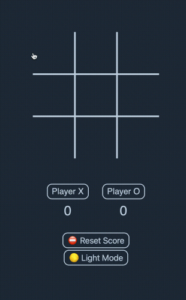

<!-- PROJECT LOGO -->
 

  

<h3 align="center">Tic Tac Toe</h3>

<!-- ABOUT THE PROJECT -->
## About The Project

#

Here's a blank template to get started: To avoid retyping too much info. Do a search and replace with your text editor for the following: `@selimmh`, `repo_name`, `twitter_handle`, `linkedin_username`, `email`, `email_client`, `project_title`, `project_description`

#

### Built With

* HTML
* CSS
* VanillaJS
